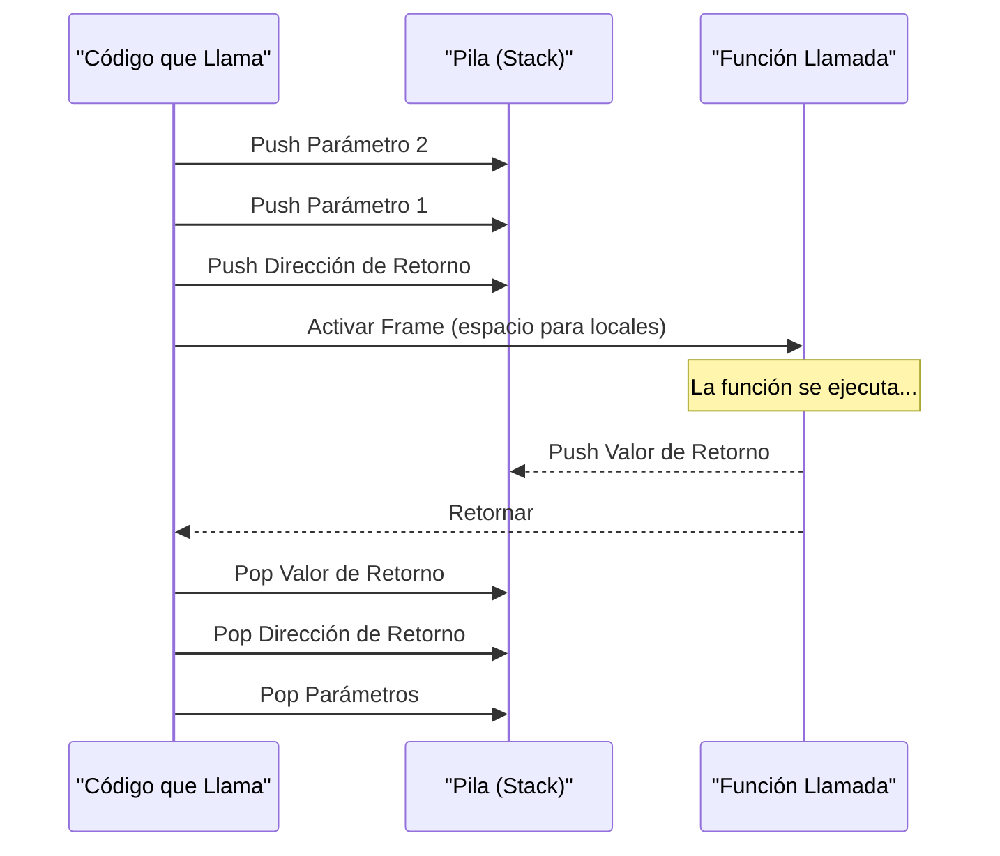

# Capítulo 13: El núcleo de la máquina virtual de Harbour

Harbour, como descendiente directo de Clipper, hereda su arquitectura fundamental pero la extiende con tecnología moderna. En el corazón de Harbour se encuentra su Máquina Virtual (VM), un potente motor de ejecución que, junto con el compilador, permite que el código fuente se convierta en aplicaciones portables y eficientes. Este capítulo desglosa los componentes esenciales de ese núcleo.

## El compilador: el proceso de conversión de código fuente a P-Code

El primer paso para transformar un programa Harbour (escrito en ficheros `.prg`) en una aplicación ejecutable es el proceso de compilación. A diferencia de los compiladores que generan directamente código máquina, el compilador de Harbour (`harbour.exe`) es un **pre-procesador y traductor**.

El proceso se puede resumir en los siguientes pasos:

1.  **Análisis del Código Fuente**: El compilador lee los ficheros `.prg` y analiza la sintaxis, las estructuras de control (IF, DO WHILE, FOR), las declaraciones de funciones y procedimientos, y las expresiones.
2.  **Generación de P-Code**: Durante el análisis, el compilador traduce las sentencias de Harbour a un lenguaje intermedio de bajo nivel llamado **P-Code** (Pseudo-código). Este P-Code es un conjunto de instrucciones optimizadas diseñadas específicamente para ser ejecutadas por la Máquina Virtual de Harbour.
3.  **Traducción a C**: Una vez generado el P-Code, el compilador de Harbour lo envuelve en código fuente C (`.c`). Es decir, no genera un fichero objeto (`.o` o `.obj`), sino un fichero de texto en lenguaje C que puede ser compilado por cualquier compilador C estándar (como GCC, Clang, MSVC, etc.).
4.  **Compilación final**: Un compilador de C se encarga de compilar estos ficheros `.c` intermedios, junto con las librerías del núcleo de Harbour (la VM y las bibliotecas de tiempo de ejecución), para producir el fichero ejecutable final (`.exe` en Windows, o un binario en Linux/macOS).

Este enfoque de "compilar a C" es lo que otorga a Harbour una de sus mayores fortalezas: la **portabilidad**. Si existe un compilador de C para una plataforma, es muy probable que Harbour pueda generar aplicaciones para ella.

El siguiente diagrama ilustra este flujo de compilación:

```mermaid
graph TD;
    subgraph "Paso 1: Compilación con Harbour"
        A[Código Fuente .prg] --> B{Compilador Harbour (harbour.exe)};
        B -- "Internamente, analiza y traduce a P-Code" --> C((Traducción a C));
        C --> D[Fichero de Código C (.c)];
    end

    subgraph "Paso 2: Compilación con un Compilador C"
        D --> E{Compilador/Enlazador C<br>(GCC, Clang, MSVC...)};
        F[Librerías Harbour<br>(VM, RTL, RDDs)] --> E;
    end
    
    E --> G[Aplicación Ejecutable<br>(.exe, binario)];

    style B fill:#e6f3ff,stroke:#333,stroke-width:2px
    style E fill:#d5f5e3,stroke:#333,stroke-width:2px
```

## La máquina virtual (VM): el motor de ejecución de Harbour

La Máquina Virtual (VM) es el corazón de cualquier aplicación Harbour en ejecución. Es un entorno de software que simula un procesador y gestiona todos los aspectos de la ejecución del programa. Sus responsabilidades principales son:

*   **Ejecución del P-Code**: La VM lee las instrucciones de P-Code una por una y las ejecuta. Cada instrucción de P-Code corresponde a una operación específica, como mover datos, realizar una operación aritmética, o llamar a una función.
*   **Gestión de Memoria**: La VM se encarga de asignar y liberar memoria para las variables, los arrays, los objetos y las cadenas de texto. Implementa un sistema de recolección de basura (*garbage collector*) que libera automáticamente la memoria que ya no está en uso, evitando fugas de memoria (*memory leaks*).
*   **Administración de la Pila**: Gestiona la pila de ejecución, que se utiliza para pasar parámetros a las funciones, almacenar variables locales y guardar los puntos de retorno de las llamadas a funciones.
*   **Manejo de Tipos de Datos**: Harbour es un lenguaje de tipado dinámico. La VM es responsable de verificar los tipos de datos en tiempo de ejecución y realizar las conversiones necesarias.
*   **Subsistema de Reemplazo de Datos (RDD)**: Aunque es un componente separado, la VM interactúa estrechamente con los RDDs para las operaciones de entrada/salida de datos, permitiendo que Harbour trabaje con diferentes formatos de fichero (DBF, NTX, CDX, etc.) de manera transparente.

La VM es la capa de abstracción que independiza el código Harbour del hardware y del sistema operativo subyacente.

Aquí se muestra un esquema de la arquitectura de la VM:

```mermaid
graph TD;
    subgraph "Máquina Virtual de Harbour (VM)"
        A[Motor de Ejecución de P-Code]
        B[Gestor de Memoria <br/> (Garbage Collector)]
        C[Administrador de la Pila]
        D[Sistema de Tipos Dinámicos]
    end

    E[Aplicación Harbour] --> A;
    A --> C;
    A --> B;
    A --> D;
    A --> F[Subsistema RDD <br/> (Acceso a Datos)];

    style A fill:#f9f,stroke:#333,stroke-width:2px
    style F fill:#ccf,stroke:#333,stroke-width:2px
```

## P-Code: el lenguaje intermedio optimizado

El P-Code (del inglés *Portable Code* o *Pseudo-code*) es el lenguaje ensamblador de la Máquina Virtual de Harbour. Es un conjunto de instrucciones binarias de bajo nivel que representan de forma compacta y eficiente el código fuente original.

Por ejemplo, una simple línea de código Harbour como:
```harbour
nResultado := (nValor1 + nValor2) * 2
```
Se traduce internamente a una secuencia de instrucciones P-Code similar a esta (conceptual):

| P-Code (Conceptual) | Descripción                                          |
| ------------------- | ---------------------------------------------------- |
| `PUSHSYM`           | Empujar el símbolo (variable) `nValor1` a la pila.   |
| `PUSHVAR`           | Empujar el valor de la variable a la pila.           |
| `PUSHSYM`           | Empujar el símbolo `nValor2` a la pila.              |
| `PUSHVAR`           | Empujar el valor de la variable a la pila.           |
| `ADD`               | Tomar los dos valores superiores de la pila y sumarlos. |
| `PUSHNUM`           | Empujar el número `2` a la pila.                     |
| `MULTIPLY`          | Tomar los dos valores superiores y multiplicarlos.   |
| `POPVAR`            | Sacar el resultado de la pila y guardarlo en `nResultado`. |

El P-Code está "optimizado" porque el compilador de Harbour realiza varias optimizaciones antes de generarlo, como la evaluación de expresiones constantes en tiempo de compilación. Esto hace que la ejecución en la VM sea mucho más rápida que si se interpretara el código `.prg` directamente.

## La pila (The Stack): gestión de llamadas a funciones y variables locales

La pila es una estructura de datos fundamental (del tipo LIFO: *Last-In, First-Out*) que la VM de Harbour utiliza para gestionar la ejecución del programa. Cada vez que se llama a una función o procedimiento, ocurre lo siguiente:

1.  **Parámetros**: Los parámetros pasados a la función se "empujan" (se colocan) en la parte superior de la pila, en orden inverso.
2.  **Dirección de Retorno**: La VM empuja la dirección de la instrucción de P-Code a la que debe regresar cuando la función termine.
3.  **Variables Locales**: Se reserva espacio en la pila para las variables declaradas como `LOCAL` dentro de la función. Estas variables solo existen mientras la función está en ejecución.
4.  **Ejecución**: La función se ejecuta, utilizando la pila para obtener sus parámetros y almacenar sus variables locales. Si la función devuelve un valor, este se deja en la cima de la pila antes de terminar.
5.  **Retorno**: Al finalizar la función (con `RETURN`), la VM "saca" (retira) de la pila las variables locales, la dirección de retorno (y salta a ella) y los parámetros. Si había un valor de retorno, este queda disponible para la instrucción que realizó la llamada.

Este mecanismo permite realizar llamadas anidadas y recursivas de forma segura y ordenada, ya que cada llamada a función tiene su propio "espacio" o *frame* en la pila. La gestión eficiente de la pila es crucial para el rendimiento y la estabilidad de las aplicaciones Harbour.

El siguiente diagrama simplifica el ciclo de vida de una llamada a función en la pila:


