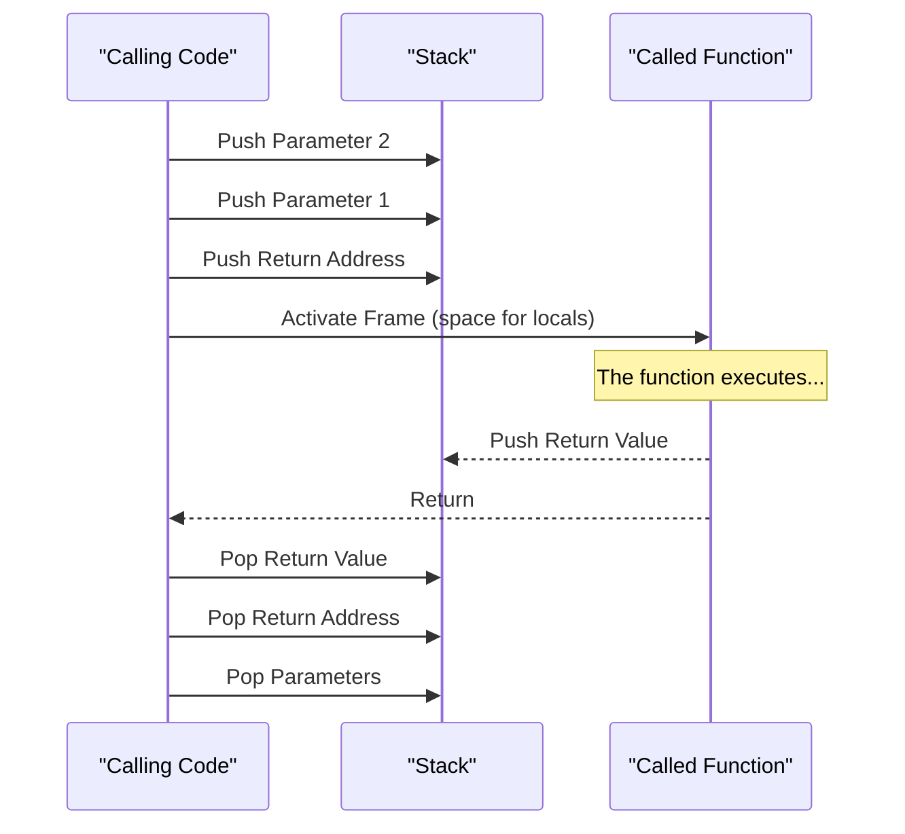

# Chapter 13: The Core of Harbour's Virtual Machine

Harbour, as a direct descendant of Clipper, inherits its fundamental architecture but extends it with modern technology. At the heart of Harbour lies its Virtual Machine (VM), a powerful execution engine that, together with the compiler, allows source code to be converted into portable and efficient applications. This chapter breaks down the essential components of that core.

## The compiler: the process of converting source code to P-Code

The first step to transform a Harbour program (written in `.prg` files) into an executable application is the compilation process. Unlike compilers that generate machine code directly, the Harbour compiler (`harbour.exe`) is a **pre-processor and translator**.

The process can be summarized in the following steps:

1.  **Source Code Analysis**: The compiler reads the `.prg` files and analyzes the syntax, control structures (IF, DO WHILE, FOR), function and procedure declarations, and expressions.
2.  **P-Code Generation**: During analysis, the compiler translates Harbour statements to a low-level intermediate language called **P-Code** (Pseudo-code). This P-Code is a set of optimized instructions designed specifically to be executed by Harbour's Virtual Machine.
3.  **Translation to C**: Once the P-Code is generated, Harbour's compiler wraps it in C source code (`.c`). That is, it doesn't generate an object file (`.o` or `.obj`), but a text file in C language that can be compiled by any standard C compiler (like GCC, Clang, MSVC, etc.).
4.  **Final compilation**: A C compiler takes care of compiling these intermediate `.c` files, along with Harbour's core libraries (the VM and runtime libraries), to produce the final executable file (`.exe` on Windows, or a binary on Linux/macOS).

This "compile to C" approach is what gives Harbour one of its greatest strengths: **portability**. If a C compiler exists for a platform, it's very likely that Harbour can generate applications for it.

The following diagram illustrates this compilation flow:

```mermaid
graph TD;
    subgraph "Step 1: Compilation with Harbour"
        A[Source Code .prg] --> B{Harbour Compiler (harbour.exe)};
        B -- "Internally, analyzes and translates to P-Code" --> C((Translation to C));
        C --> D[C Code File (.c)];
    end

    subgraph "Step 2: Compilation with a C Compiler"
        D --> E{C Compiler/Linker<br>(GCC, Clang, MSVC...)};
        F[Harbour Libraries<br>(VM, RTL, RDDs)] --> E;
    end
    
    E --> G[Executable Application<br>(.exe, binary)];

    style B fill:#e6f3ff,stroke:#333,stroke-width:2px
    style E fill:#d5f5e3,stroke:#333,stroke-width:2px
```

## The virtual machine (VM): Harbour's execution engine

The Virtual Machine (VM) is the heart of any running Harbour application. It is a software environment that simulates a processor and manages all aspects of program execution. Its main responsibilities are:

*   **P-Code Execution**: The VM reads P-Code instructions one by one and executes them. Each P-Code instruction corresponds to a specific operation, such as moving data, performing an arithmetic operation, or calling a function.
*   **Memory Management**: The VM takes care of allocating and freeing memory for variables, arrays, objects and text strings. It implements a garbage collection system that automatically frees memory that is no longer in use, avoiding memory leaks.
*   **Stack Administration**: Manages the execution stack, which is used to pass parameters to functions, store local variables and save return points of function calls.
*   **Data Type Handling**: Harbour is a dynamically typed language. The VM is responsible for checking data types at runtime and performing necessary conversions.
*   **Replaceable Database Driver (RDD) Subsystem**: Although it's a separate component, the VM interacts closely with RDDs for data input/output operations, allowing Harbour to work with different file formats (DBF, NTX, CDX, etc.) transparently.

The VM is the abstraction layer that makes Harbour code independent from the underlying hardware and operating system.

Here is a schema of the VM architecture:

```mermaid
graph TD;
    subgraph "Harbour Virtual Machine (VM)"
        A[P-Code Execution Engine]
        B[Memory Manager <br/> (Garbage Collector)]
        C[Stack Administrator]
        D[Dynamic Type System]
    end

    E[Harbour Application] --> A;
    A --> C;
    A --> B;
    A --> D;
    A --> F[RDD Subsystem <br/> (Data Access)];

    style A fill:#f9f,stroke:#333,stroke-width:2px
    style F fill:#ccf,stroke:#333,stroke-width:2px
```

## P-Code: the optimized intermediate language

P-Code (from *Portable Code* or *Pseudo-code*) is the assembly language of Harbour's Virtual Machine. It is a set of low-level binary instructions that represent the original source code in a compact and efficient way.

For example, a simple line of Harbour code like:
```harbour
nResult := (nValue1 + nValue2) * 2
```
Is internally translated to a sequence of P-Code instructions similar to this (conceptual):

| P-Code (Conceptual) | Description                                          |
| ------------------- | ---------------------------------------------------- |
| `PUSHSYM`           | Push the symbol (variable) `nValue1` to the stack.   |
| `PUSHVAR`           | Push the variable value to the stack.               |
| `PUSHSYM`           | Push the symbol `nValue2` to the stack.             |
| `PUSHVAR`           | Push the variable value to the stack.               |
| `ADD`               | Take the two top values from the stack and add them. |
| `PUSHNUM`           | Push the number `2` to the stack.                   |
| `MULTIPLY`          | Take the two top values and multiply them.          |
| `POPVAR`            | Pop the result from the stack and store it in `nResult`. |

The P-Code is "optimized" because Harbour's compiler performs several optimizations before generating it, such as evaluating constant expressions at compile time. This makes execution in the VM much faster than if the `.prg` code were interpreted directly.

## The stack: managing function calls and local variables

The stack is a fundamental data structure (of the LIFO type: *Last-In, First-Out*) that Harbour's VM uses to manage program execution. Each time a function or procedure is called, the following happens:

1.  **Parameters**: The parameters passed to the function are "pushed" (placed) at the top of the stack, in reverse order.
2.  **Return Address**: The VM pushes the address of the P-Code instruction to which it must return when the function ends.
3.  **Local Variables**: Space is reserved on the stack for variables declared as `LOCAL` within the function. These variables only exist while the function is executing.
4.  **Execution**: The function executes, using the stack to get its parameters and store its local variables. If the function returns a value, this is left at the top of the stack before ending.
5.  **Return**: When the function ends (with `RETURN`), the VM "pops" (removes) from the stack the local variables, the return address (and jumps to it) and the parameters. If there was a return value, this remains available for the instruction that made the call.

This mechanism allows safe and orderly nested and recursive calls, since each function call has its own "space" or *frame* on the stack. Efficient stack management is crucial for the performance and stability of Harbour applications.

The following diagram simplifies the lifecycle of a function call on the stack:

